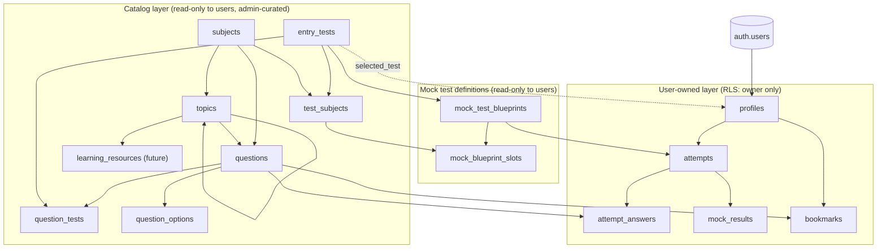
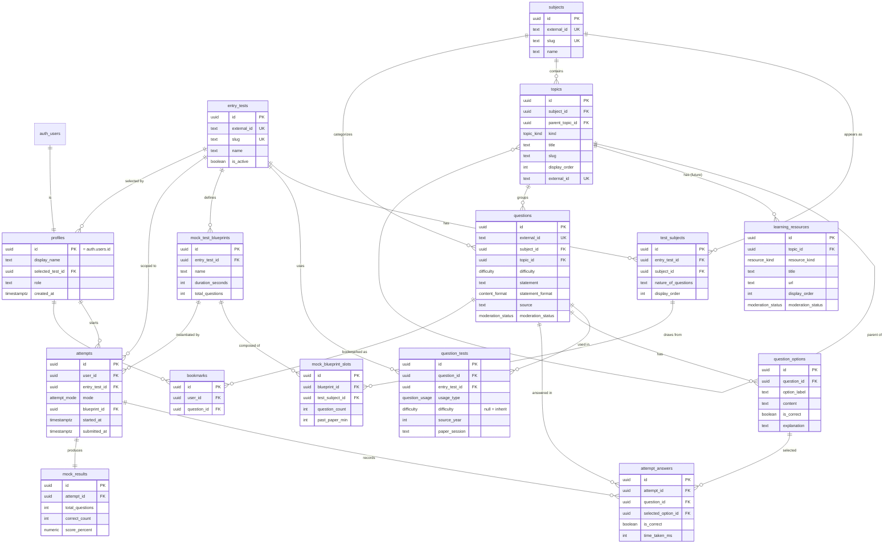

 # Design Document: MCQ Platform Schema

## Overview

This document designs the Postgres/Supabase database schema for **Taleem ka Safar**, an entry-test preparation platform. The schema models a multi-test question bank (starting with "NET Engineering", extensible to MDCAT/ECAT/NTS/etc.), two per-test usage types (`practice` and `past_paper`, tracked per question-test relationship), two study modes (practice and timed mock tests), and full per-user attempt analytics. It targets Postgres 17 on Supabase with Row Level Security (RLS) enabled on every table.

The central design tension is **reuse vs. per-test customization**. The same logical subject (e.g. Physics) appears across many entry tests, and — critically — the *same MCQ* can be a NET past-paper question and an ECAT practice question at the same time. Whether a question is `past_paper` or `practice` is not a property of the question; it is a property of the (question, test) relationship. We therefore **decouple a question's content from how each test uses it**: canonical `subjects` and `topics` describe what a question *is*, a `questions` row holds the content once, and a `question_tests` join table carries the per-test usage (`past_paper`/`practice`), optional per-test difficulty override, and past-paper provenance. `test_subjects` becomes a pure composition link defining which canonical subjects a test includes plus per-test subject metadata. This lets the same question be curated into many entry tests with **zero duplication and no quality compromise** — every question shown for a test is explicitly tagged for that test, never randomly borrowed.

The design prioritizes: (1) **extensibility** — new tests/subjects/types are data, not migrations; (2) **idempotent import** — stable external IDs let `mcqs/` re-imports upsert without duplicates; (3) **analytics-first** — a session/attempt entity separate from per-question answers powers accuracy, weak-area, and progress reporting; and (4) **security** — the question bank is read-only to authenticated users while all user-owned rows are owner-restricted via RLS.

This is a schema-only design. It defines tables, types, constraints, indexes, enums, RLS policies, an ER diagram, the mock-test generation/scoring model, and the import-mapping from the existing CSV shape. Application code (queries, pages) is out of scope here.

---

## Architecture

The schema is organized into four logical layers. Arrows denote "references / belongs to".



Layer summary:

| Layer | Tables | RLS posture |
|-------|--------|-------------|
| **Catalog** | `entry_tests`, `subjects`, `test_subjects`, `topics`, `questions`, `question_tests`, `question_options`, `learning_resources` (future) | Authenticated users: `SELECT` only. Writes reserved for admin/service role. |
| **Mock definitions** | `mock_test_blueprints`, `mock_blueprint_slots` | Authenticated users: `SELECT` only (active blueprints). |
| **User-owned** | `profiles`, `attempts`, `attempt_answers`, `mock_results`, `bookmarks` | Owner-only `SELECT/INSERT/UPDATE/DELETE` keyed on `auth.uid()`. |
| **Supabase managed** | `auth.users` (not created here) | Managed by Supabase Auth. |

---

## Key Design Decisions (and rationale)

These resolve the ambiguous points the request flagged. Defaults are chosen and justified rather than deferred.

### D1 — Canonical subjects; `test_subjects` is composition-only
`subjects` holds the *logical* subject once (Physics, Mathematics, English). `test_subjects` links a subject to an entry test and carries **per-test subject metadata**: display order, the test-specific "nature of questions" description, a difficulty profile, and `is_active`. Its **only** role is defining which canonical subjects a test includes (and how that subject is described/weighted for that test). Questions and topics do **not** reference `test_subjects` — they reference the canonical `subjects` directly (see D-decoupling). Mock blueprint slots still reference `test_subjects` to obtain the `(entry_test, subject)` pair. `unique(entry_test_id, subject_id)` keeps a subject appearing once per test. This cleanly satisfies "same logical subject across tests" + "per-test difficulty/nature" without partitioning the question bank by test.

### D2 — `topics` is a self-referential syllabus tree (per-subject variable depth)
The syllabus depth **varies per subject**: Maths and Physics go *Subject → Chapter → (optional Topics inside a chapter)*, while English goes *Subject → Topic* with **no chapter layer**. Two rigid tables (a `chapters` table plus a `topics` table) would break any subject that has no chapters (English) and would force awkward special-casing. The standard CMS/LMS pattern for a variable-depth, per-subject hierarchy is a single **self-referential tree (adjacency list)**: one `topics` table where every row is a *node* in its subject's syllabus tree, linked to its parent via `parent_topic_id` (null = top-level node directly under the subject).

A "chapter" is simply a top-level node displayed as a chapter; a "topic" is a node displayed as a topic. To label this **per node** (not by depth — English's top-level nodes are topics while Maths/Physics top-level nodes are chapters) we add a `topic_kind` enum (`chapter`, `topic`, `subtopic`) and a `kind` column set explicitly per node. This supports 1-level (English) or 2-level/deeper (Maths/Physics) hierarchies under one subject with **no special-casing** and without breaking subjects that have no chapters.

Decision: `topics` reference the canonical `subject_id` (not `test_subjects`) so the tree is stable across all tests that include that subject. We replace the old chapter-specific columns (`chapter_number`, `chapter_slug`, `chapter_title`) with **generic node columns**: `title` (display name), `slug` (URL-safe, stable), and `display_order` (the visible ordering, i.e. the "01, 02" chapter number shown in the UI). Sibling slugs are unique under the same parent (`unique (subject_id, parent_topic_id, slug)`). A `unique (id, subject_id)` on `topics` backs a composite FK from `questions` so a question's topic must belong to the question's subject (declarative integrity), and a composite self-FK `(parent_topic_id, subject_id) → topics(id, subject_id)` guarantees a node and its parent are always in the same subject.

Questions attach to **any** node via `questions.topic_id`: a chapter node when the subject has no deeper topics, or a leaf topic node otherwise. "Practice all MCQs in a chapter" = all questions whose topic is that node **or any descendant**, expressed as a recursive-CTE subtree query (trivial at hundreds of nodes; an optional denormalized root/ancestor cache can be added only if scale ever demands it).

### D3 — Options as rows, not four columns
The CSV stores `option_a..option_d`. We normalize to a `question_options` table (one row per option). Rationale: supports a future where some tests aren't strictly 4-option, enables `content_format` per option (math rendering), and makes "the correct option" a boolean on the option row rather than a letter that must be cross-referenced. A `CHECK`-backed convention plus a partial unique index enforces "exactly one correct option per question". The import maps a/b/c/d to `option_label` + `display_order`.

### D4 — Decouple question content from per-test usage (`questions` + `question_tests`)
`past_paper` vs `practice` is **not** a property of a question — it is a property of the (question, test) relationship. The same MCQ can be a NET past-paper question and an ECAT practice question simultaneously. Modeling usage as a column on `questions` (the old approach) forced either duplicating the question per test or losing this distinction. Decision: split the model.

- **`questions`** holds the content once: statement, explanation, options (via `question_options`), canonical `subject_id` + `topic_id`, a base/default `difficulty`, `source`, moderation. No usage type, no per-test fields.
- **`question_tests`** is a join with one row per (question, entry_test) the question is used in. It carries `usage_type` (`past_paper`/`practice`) — how *this* test uses the question — plus an optional per-test `difficulty` override and past-paper provenance (`source_year`, `paper_session`).

This enables **curated reuse with zero duplication**: a question is explicitly tagged into each test it belongs to (never randomly borrowed), so quality is never compromised, while the same content row serves many tests. The **effective difficulty** for a question in a test is `COALESCE(question_tests.difficulty, questions.difficulty)` — a deterministic resolution that lets a shared question be "medium" by default but "hard" specifically in ECAT.

**Sparse usage (no flags to clean up):** a question only gets a `question_tests` row for tests that **actually use it**. If 3 of 8 tests use a question, exactly 3 rows exist; the other 5 simply have no row — there is no boolean flag, nothing to toggle, and nothing to clean up. "Questions for test X" is a simple indexed join on `question_tests.entry_test_id`.

### D5 — Enums for closed sets, lookup table for open sets
`question_usage` (`past_paper`, `practice`), `difficulty` (`easy`, `medium`, `hard`), `content_format` (`plain`, `latex`, `markdown`), `attempt_mode` (`practice`, `mock`), `attempt_status`, and `moderation_status` are Postgres `ENUM` types — small, stable, closed sets. Entry tests and subjects are **data rows**, not enums, because they grow frequently.

### D6 — Stable, namespaced external IDs for idempotent import
Every catalog table that originates from `mcqs/` carries a unique `external_id`. The surrogate `uuid` `id` is the internal join key; `external_id` is the stable **business/source key** that enables idempotent upsert (`INSERT ... ON CONFLICT (external_id) DO UPDATE`), so re-running the import never duplicates and always reconciles edits.

We adopt a **namespaced** convention so keys are globally unique, human-readable, and collision-free across subjects:
- **questions**: `<subject_slug>-<chapter_or_topic_ref>-q<n>` — e.g. `physics-ch1-q5`, `maths-ch3-q12`, `english-synonyms-q4`. Namespacing by subject guarantees global uniqueness; the old bare form (`ch1-q1`) could collide across subjects (Physics ch1 vs Maths ch1).
- **topics**: `<subject_slug>:<slug>` or `<subject_slug>:ch<n>` — e.g. `physics:kinematics-and-dynamics`, `physics:ch1`. Kept unique.

`question_tests` is idempotent on `(question_id, entry_test_id)`. The Import Mapping section documents how the CSV `id` is normalized into this namespaced `external_id`.

### D7 — Attempts split from answers; one model for both modes
A single `attempts` table represents a session (mode = `practice` or `mock`). `attempt_answers` holds one row per answered question. Mock-specific outcome data lives in `mock_results` (1:1 with a mock attempt). This unifies analytics (all answered questions flow through `attempt_answers`) while keeping mock scoring/timing separate. Rationale detailed in the Mock Test Model section.

### D8 — `flag_for_review` becomes structured moderation
The CSV `flag_for_review` free-text reason is retained as `questions.review_note` (text) plus a `moderation_status` enum (`approved`, `flagged`, `draft`). Flagged questions are excluded from user-facing queries by application/RLS-friendly views, retained for curators.

### D9 — Timestamps everywhere; soft-delete only where it matters
All tables get `created_at` / `updated_at` (trigger-maintained). Soft delete (`deleted_at timestamptz`) is applied to catalog tables (`questions`, `topics`, `test_subjects`, and the future `learning_resources`) so retiring a question never orphans historical `attempt_answers`. User-owned transactional rows (`attempt_answers`, `mock_results`) are hard-deletable with the parent. `profiles`/`bookmarks` are hard delete. `question_tests` rows are hard-deleted with their parent question (cascade) since removing a usage tag carries no historical-analytics value on its own.

### D10 — Admin/teacher role: deferred but designed-in
For now, all users are students. We add `profiles.role` (`student` | `admin`, default `student`) and write catalog-write RLS policies that check `role = 'admin'`. No admin UI is built now, but enabling curation later is a policy/data change, not a schema migration. The service role (used by the import script) bypasses RLS regardless.

### D11 — `learning_resources` for Quick Notes & Lectures (future, node-attached, test-independent)
The UI exposes four content buttons per chapter: **Past Paper MCQs**, **Practice MCQs**, **Quick Notes** (slides), and **Lectures** (videos). Past-paper and practice MCQs are already modeled (`questions` + `question_tests.usage_type`). Quick Notes and Lectures are **future** features. We design a clean home for them now — a `learning_resources` table — but state it is **scaffolding**: it is not built in the initial migration (or is created empty) and is not over-built.

Decision: learning resources attach to a **node** (`topic_id`) and are **test-independent by default**, mirroring how topics are canonical — the same Physics chapter notes serve every test that includes Physics. A `resource_kind` enum (`note`, `slides`, `video`) discriminates the type. If per-test variation is ever needed, it can be tagged later via a parallel join (analogous to `question_tests`) — a non-breaking, additive change.

---

## Entity Relationship Diagram



---

## Data Models — Enums

```sql
-- Closed, stable sets modeled as Postgres enums.
create type question_usage     as enum ('past_paper', 'practice');  -- how a test uses a question
create type difficulty         as enum ('easy', 'medium', 'hard');
create type content_format     as enum ('plain', 'latex', 'markdown');
create type attempt_mode       as enum ('practice', 'mock');
create type attempt_status     as enum ('in_progress', 'submitted', 'abandoned');
create type moderation_status  as enum ('draft', 'flagged', 'approved');
create type user_role          as enum ('student', 'admin');
create type topic_kind         as enum ('chapter', 'topic', 'subtopic');  -- how a syllabus node is displayed (D2)
create type resource_kind      as enum ('note', 'slides', 'video');       -- learning_resources type (D11, future)
```

Notes:
- Adding an enum value later is `ALTER TYPE ... ADD VALUE` (cheap, non-blocking in PG12+).
- `question_usage` replaces the old `question_type` enum. Usage is now a property of the (question, test) relationship (`question_tests.usage_type`), not of the question itself (D4).
- `difficulty` mirrors the CSV's `easy/medium/hard` and is used both for a question's base difficulty and for an optional per-test override. `content_format` defaults to `plain` to match current plain-text math (`sqrt(3)`, `i^2`); rows can be flipped to `latex` when math rendering ships.
- `topic_kind` labels each syllabus node per-node (not by depth): English's top-level nodes are `topic`, Maths/Physics top-level nodes are `chapter` (D2). `resource_kind` discriminates future learning resources (D11).

---

## Data Models — Catalog Layer DDL

### Shared helper: updated_at trigger

```sql
create or replace function set_updated_at()
returns trigger language plpgsql as $$
begin
  new.updated_at = now();
  return new;
end;
$$;
-- Attached to every table with an updated_at column (shown once; repeat per table).
```

### `entry_tests`

Top-level choice. One row per test the platform supports.

```sql
create table entry_tests (
  id            uuid primary key default gen_random_uuid(),
  external_id   text not null unique,          -- stable import key, e.g. 'net-engineering'
  slug          text not null unique,          -- url-safe, e.g. 'net-engineering'
  name          text not null,                 -- 'NET Engineering'
  description   text,
  source        text,                          -- e.g. 'OETP guidebook / past papers'
  is_active     boolean not null default true, -- hide from selection without deleting
  display_order int not null default 0,
  created_at    timestamptz not null default now(),
  updated_at    timestamptz not null default now()
);
create index idx_entry_tests_active on entry_tests (is_active, display_order);

create trigger trg_entry_tests_updated
  before update on entry_tests
  for each row execute function set_updated_at();
```

### `subjects`

The logical subject, shared across tests (D1).

```sql
create table subjects (
  id          uuid primary key default gen_random_uuid(),
  external_id text not null unique,   -- 'mathematics', 'physics', 'english'
  slug        text not null unique,
  name        text not null,
  created_at  timestamptz not null default now(),
  updated_at  timestamptz not null default now()
);

create trigger trg_subjects_updated
  before update on subjects
  for each row execute function set_updated_at();
```

### `test_subjects`

Per-test instance of a subject, carrying test-specific metadata (D1). This is a **composition link only**: it declares which canonical subjects a test includes and how each is described/weighted. Questions and topics do **not** hang off this — they reference canonical `subjects` (D2, D4). Mock blueprint slots reference `test_subjects` to resolve the `(entry_test, subject)` pair.

```sql
create table test_subjects (
  id                  uuid primary key default gen_random_uuid(),
  entry_test_id       uuid not null references entry_tests (id) on delete cascade,
  subject_id          uuid not null references subjects (id)   on delete restrict,
  nature_of_questions text,                       -- test-specific description of question style
  difficulty_profile  jsonb not null default '{}'::jsonb,  -- e.g. {"easy":0.3,"medium":0.5,"hard":0.2}
  display_order       int not null default 0,
  is_active           boolean not null default true,
  deleted_at          timestamptz,                -- soft delete (D8)
  created_at          timestamptz not null default now(),
  updated_at          timestamptz not null default now(),
  unique (entry_test_id, subject_id)              -- a subject appears once per test
);
create index idx_test_subjects_test on test_subjects (entry_test_id, display_order)
  where deleted_at is null;

create trigger trg_test_subjects_updated
  before update on test_subjects
  for each row execute function set_updated_at();
```

`difficulty_profile` (jsonb) holds the per-test difficulty mix as data — used both for display and as a default weighting hint for mock generation. Kept flexible (jsonb) because tests differ in how they describe difficulty.

### `topics`

A **node in the subject's syllabus tree** — a self-referential adjacency list supporting variable, per-subject depth (D2). A node is displayed as a chapter, topic, or subtopic per its `kind`. Top-level nodes (`parent_topic_id is null`) sit directly under the subject; Maths/Physics label these `chapter`, English labels them `topic`. Topics are stable across all tests that include the subject.

```sql
create table topics (
  id              uuid primary key default gen_random_uuid(),
  external_id     text not null unique,            -- namespaced, e.g. 'physics:kinematics-and-dynamics' or 'physics:ch1' (D6)
  subject_id      uuid not null references subjects (id) on delete cascade,
  parent_topic_id uuid,                            -- null = top-level node directly under the subject
  kind            topic_kind not null default 'topic',  -- how this node is displayed (per-node, not by depth) (D2)
  title           text not null,                   -- display name, e.g. 'Kinematics & Dynamics'
  slug            text not null,                   -- url-safe, stable, e.g. 'kinematics-and-dynamics'
  display_order   int not null default 0,          -- visible ordering / the "01, 02" chapter number in the UI
  source_ref      text,                            -- optional free-text provenance, e.g. 'Physics Ch 2' from the source book
  deleted_at      timestamptz,
  created_at      timestamptz not null default now(),
  updated_at      timestamptz not null default now(),
  -- Backs the composite FK from questions: a question's topic must belong to
  -- the question's subject (D2).
  unique (id, subject_id),
  -- Sibling slugs are unique under the same parent within a subject (D2).
  unique (subject_id, parent_topic_id, slug),
  -- A node and its parent are always in the same subject (composite self-FK).
  -- ON DELETE NO ACTION: nodes are soft-deleted (deleted_at), never hard-deleted
  -- from under a child.
  constraint fk_topics_parent_subject
    foreign key (parent_topic_id, subject_id)
    references topics (id, subject_id)
    match simple on delete no action
);
-- Tree traversal: children of a node, ordered, live only.
create index idx_topics_subject_parent on topics (subject_id, parent_topic_id, display_order)
  where deleted_at is null;
create index idx_topics_parent on topics (parent_topic_id);

create trigger trg_topics_updated
  before update on topics
  for each row execute function set_updated_at();
```

> **Variable per-subject depth, no special-casing.** A subject's syllabus is a tree: English is one level (`Subject → topic`), Maths/Physics are two or more (`Subject → chapter → topic`). Questions attach to **any** node via `questions.topic_id` — a chapter node when there is no deeper level, or a leaf topic node otherwise. "All MCQs in a chapter" = questions whose topic is that node **or any descendant**, a recursive-CTE subtree query (trivial at hundreds of nodes; an optional denormalized root/ancestor cache can be added only if scale demands). The composite self-FK `(parent_topic_id, subject_id) → topics(id, subject_id)` (MATCH SIMPLE so a null parent is allowed for top-level nodes) guarantees a node and its parent share a subject.

### `learning_resources` (future / scaffolding)

> **Status: scaffolding for a future feature (D11).** This table is designed now but is **not** populated by the initial migration — it is created empty (or deferred) to give Quick Notes (slides) and Lectures (videos) a clean home later. It is intentionally minimal; do not over-build it.

A learning resource (a note, a slide deck, or a video) attached to a syllabus **node** and **test-independent** by default — the same Physics chapter notes serve every test that includes Physics, mirroring how topics are canonical (D11).

```sql
create table learning_resources (
  id                uuid primary key default gen_random_uuid(),
  topic_id          uuid not null references topics (id) on delete cascade,
  resource_kind     resource_kind not null,        -- 'note' | 'slides' | 'video'
  title             text not null,
  url               text,                           -- external URL, or use storage_path for Supabase Storage
  storage_path      text,                           -- Supabase Storage path (slides/video assets)
  display_order     int not null default 0,
  moderation_status moderation_status not null default 'draft',
  deleted_at        timestamptz,
  created_at        timestamptz not null default now(),
  updated_at        timestamptz not null default now()
);
create index idx_learning_resources_topic on learning_resources (topic_id, display_order)
  where deleted_at is null;

create trigger trg_learning_resources_updated
  before update on learning_resources
  for each row execute function set_updated_at();
```

> Resources attach to a node and are test-independent. If per-test variation is ever required, a parallel join (analogous to `question_tests`) can tag resources per test later without breaking this table (D11).

### `questions`

The MCQ **content**, stored once and reused across tests. References the canonical `subject_id` and `topic_id` directly (D2, D4). Per-test usage lives in `question_tests`.

```sql
create table questions (
  id                uuid primary key default gen_random_uuid(),
  external_id       text not null unique,          -- namespaced CSV id, e.g. 'physics-ch1-q5', 'english-synonyms-q4' (D6)
  subject_id        uuid not null references subjects (id) on delete restrict,
  topic_id          uuid,                          -- nullable; FK composite below
  difficulty        difficulty not null default 'medium',  -- canonical/default difficulty
  statement         text not null,                 -- CSV statement
  statement_format  content_format not null default 'plain',
  explanation       text,                          -- CSV explanation (question-level)
  explanation_format content_format not null default 'plain',
  source            text,                          -- CSV resource, e.g. 'oetp'
  moderation_status moderation_status not null default 'approved',
  review_note       text,                          -- CSV flag_for_review reason (D8)
  image_path        text,                          -- Supabase Storage path (physics diagrams, future)
  deleted_at        timestamptz,
  created_at        timestamptz not null default now(),
  updated_at        timestamptz not null default now(),
  -- A question's topic must belong to the question's subject (D2).
  -- MATCH SIMPLE: when topic_id is null the constraint is not checked, so
  -- topic-less questions remain allowed. ON DELETE NO ACTION because topics
  -- are soft-deleted (deleted_at), so referenced topics are never hard-deleted
  -- from under a question; SET NULL is unusable here as it would also null the
  -- NOT NULL subject_id column.
  constraint fk_questions_topic_subject
    foreign key (topic_id, subject_id)
    references topics (id, subject_id)
    match simple on delete no action
);

-- Hot path: "give me approved questions for this subject, by difficulty/topic".
-- Usage-type (past_paper/practice) filtering happens on the question_tests join.
create index idx_questions_subject on questions (subject_id)
  where deleted_at is null and moderation_status = 'approved';
create index idx_questions_topic on questions (topic_id)
  where deleted_at is null and moderation_status = 'approved';
create index idx_questions_subject_difficulty on questions (subject_id, difficulty)
  where deleted_at is null and moderation_status = 'approved';
-- Moderation queue
create index idx_questions_moderation on questions (moderation_status)
  where moderation_status <> 'approved';

create trigger trg_questions_updated
  before update on questions
  for each row execute function set_updated_at();
```

> The composite FK `(topic_id, subject_id) → topics(id, subject_id)` is declared `MATCH SIMPLE` so a null `topic_id` is permitted (topic-less questions). When `topic_id` is set, Postgres guarantees the referenced topic's `subject_id` equals the question's `subject_id` — the topic/subject consistency invariant is enforced by the database, not just the importer. Topics are retired via soft delete (`deleted_at`), so a live question never references a hard-deleted topic.

### `question_tests`

The join that carries **per-test usage** (D4). One row per (question, entry_test) the question is used in. The same question can be a NET past-paper and an ECAT practice question simultaneously — two rows, one content row.

```sql
create table question_tests (
  id            uuid primary key default gen_random_uuid(),
  question_id   uuid not null references questions (id)   on delete cascade,
  entry_test_id uuid not null references entry_tests (id) on delete cascade,
  usage_type    question_usage not null,         -- how THIS test uses the question
  difficulty    difficulty,                      -- per-test override; null = inherit questions.difficulty
  source_year   int,                             -- past-paper provenance, e.g. 2023 (optional)
  paper_session text,                            -- e.g. 'NET 2023 Session II' (optional)
  created_at    timestamptz not null default now(),
  updated_at    timestamptz not null default now(),
  unique (question_id, entry_test_id)            -- a question has at most one usage row per test
);

-- Hot path: "for this test, give me past_paper (then practice) questions".
create index idx_question_tests_test_usage on question_tests (entry_test_id, usage_type);
-- Reverse lookup: "which tests use this question / its usage rows".
create index idx_question_tests_question on question_tests (question_id);

create trigger trg_question_tests_updated
  before update on question_tests
  for each row execute function set_updated_at();
```

> **Effective difficulty** for a question within a test is `COALESCE(question_tests.difficulty, questions.difficulty)` — deterministic and used by mock difficulty weighting. The mock-generation hot path joins `questions` (filtered to live + approved) with `question_tests` (filtered by `entry_test_id` + `usage_type`); the two partial/composite indexes above back that join.

### `question_options`

One row per option (D3). `option_a..d` from the CSV map to four rows with `option_label` and `display_order`.

```sql
create table question_options (
  id            uuid primary key default gen_random_uuid(),
  question_id   uuid not null references questions (id) on delete cascade,
  option_label  text not null,                   -- 'a' | 'b' | 'c' | 'd' (extensible)
  content       text not null,                   -- option text
  content_format content_format not null default 'plain',
  is_correct    boolean not null default false,
  display_order int not null default 0,
  created_at    timestamptz not null default now(),
  updated_at    timestamptz not null default now(),
  unique (question_id, option_label)
);
create index idx_question_options_question on question_options (question_id);

-- Enforce AT MOST one correct option per question (D3).
create unique index uq_one_correct_option
  on question_options (question_id)
  where is_correct = true;

create trigger trg_question_options_updated
  before update on question_options
  for each row execute function set_updated_at();
```

> "Exactly one correct option" = the partial unique index above (at most one) + an import/validation rule and an optional deferred constraint trigger ensuring at least one exists. Questions whose `correct_option` was unrecoverable in the CSV (blank) are imported with `moderation_status = 'flagged'` and no correct option, excluded from user queries.

---

## Data Models — Mock Test Definitions DDL

### `mock_test_blueprints`

A reusable definition of a mock test for an entry test (D7). Generation reads the blueprint + its slots.

```sql
create table mock_test_blueprints (
  id               uuid primary key default gen_random_uuid(),
  external_id      text unique,                    -- optional stable key for seeded blueprints
  entry_test_id    uuid not null references entry_tests (id) on delete cascade,
  name             text not null,                  -- 'NET Engineering Full Mock'
  description      text,
  duration_seconds int not null,                   -- timed test length
  total_questions  int not null,                   -- expected sum of slot counts
  is_active        boolean not null default true,
  display_order    int not null default 0,
  created_at       timestamptz not null default now(),
  updated_at       timestamptz not null default now(),
  constraint chk_blueprint_duration check (duration_seconds > 0),
  constraint chk_blueprint_total    check (total_questions > 0)
);
create index idx_blueprints_test on mock_test_blueprints (entry_test_id, is_active, display_order);

create trigger trg_blueprints_updated
  before update on mock_test_blueprints
  for each row execute function set_updated_at();
```

### `mock_blueprint_slots`

Per-subject composition of a blueprint: how many questions from each subject, and the past-paper / difficulty mix. This encodes "maximize past-paper + some practice, mixed difficulty".

```sql
create table mock_blueprint_slots (
  id              uuid primary key default gen_random_uuid(),
  blueprint_id    uuid not null references mock_test_blueprints (id) on delete cascade,
  test_subject_id uuid not null references test_subjects (id) on delete restrict,
  question_count  int not null,                    -- total questions drawn from this subject
  past_paper_min  int not null default 0,          -- floor of past_paper questions (maximize)
  practice_max    int,                             -- cap on practice questions (null = no cap)
  difficulty_mix  jsonb not null default '{}'::jsonb, -- {"easy":n,"medium":n,"hard":n} target counts
  display_order   int not null default 0,
  created_at      timestamptz not null default now(),
  updated_at      timestamptz not null default now(),
  unique (blueprint_id, test_subject_id),
  constraint chk_slot_count check (question_count > 0),
  constraint chk_slot_pp    check (past_paper_min >= 0 and past_paper_min <= question_count)
);
create index idx_slots_blueprint on mock_blueprint_slots (blueprint_id, display_order);

create trigger trg_slots_updated
  before update on mock_blueprint_slots
  for each row execute function set_updated_at();
```

> A slot references a `test_subjects` row, which resolves to an `(entry_test_id, subject_id)` pair. Generation uses that pair to query `questions JOIN question_tests` (D4): candidate questions are `questions.subject_id = slot.subject` intersected with `question_tests.entry_test_id = slot.entry_test`, filtered by `usage_type`. `test_subjects` no longer owns questions — it only names the subject and supplies the per-test difficulty profile.

---

## Data Models — User-Owned Layer DDL

### `profiles`

Extends `auth.users` with app data (D10). PK equals the auth user id.

```sql
create table profiles (
  id               uuid primary key references auth.users (id) on delete cascade,
  display_name     text,
  selected_test_id uuid references entry_tests (id) on delete set null,
  role             user_role not null default 'student',
  avatar_url       text,
  created_at       timestamptz not null default now(),
  updated_at       timestamptz not null default now()
);
create index idx_profiles_selected_test on profiles (selected_test_id);

create trigger trg_profiles_updated
  before update on profiles
  for each row execute function set_updated_at();
```

A trigger on `auth.users` (AFTER INSERT) auto-creates a `profiles` row:

```sql
create or replace function handle_new_user()
returns trigger language plpgsql security definer set search_path = public as $$
begin
  insert into public.profiles (id, display_name)
  values (new.id, coalesce(new.raw_user_meta_data->>'full_name', new.email))
  on conflict (id) do nothing;
  return new;
end;
$$;

create trigger on_auth_user_created
  after insert on auth.users
  for each row execute function handle_new_user();
```

### `attempts`

One session in either mode (D7). For mock attempts, `blueprint_id` is set and `expires_at` enforces timing.

```sql
create table attempts (
  id            uuid primary key default gen_random_uuid(),
  user_id       uuid not null references profiles (id) on delete cascade,
  entry_test_id uuid not null references entry_tests (id) on delete restrict,
  mode          attempt_mode not null,             -- 'practice' | 'mock'
  status        attempt_status not null default 'in_progress',
  blueprint_id  uuid references mock_test_blueprints (id) on delete set null, -- only for mock
  -- Optional practice-mode scoping (free practice within a subject/topic):
  test_subject_id uuid references test_subjects (id) on delete set null,
  topic_id      uuid references topics (id) on delete set null,
  started_at    timestamptz not null default now(),
  expires_at    timestamptz,                       -- started_at + blueprint.duration for mocks
  submitted_at  timestamptz,
  created_at    timestamptz not null default now(),
  updated_at    timestamptz not null default now(),
  -- A mock attempt must reference a blueprint; a practice attempt must not.
  constraint chk_mock_blueprint check (
    (mode = 'mock'     and blueprint_id is not null) or
    (mode = 'practice' and blueprint_id is null)
  )
);
create index idx_attempts_user_test on attempts (user_id, entry_test_id, started_at desc);
create index idx_attempts_user_mode on attempts (user_id, mode, status);

create trigger trg_attempts_updated
  before update on attempts
  for each row execute function set_updated_at();
```

### `attempt_answers`

One row per answered question, the analytics backbone (D7). `selected_option_id` is null for skipped/unanswered.

```sql
create table attempt_answers (
  id                 uuid primary key default gen_random_uuid(),
  attempt_id         uuid not null references attempts (id) on delete cascade,
  question_id        uuid not null references questions (id) on delete restrict,
  selected_option_id uuid references question_options (id) on delete set null,
  is_correct         boolean,                       -- null = unanswered/skipped
  time_taken_ms      int,                           -- per-question time for analytics
  answered_at        timestamptz not null default now(),
  created_at         timestamptz not null default now(),
  unique (attempt_id, question_id)                  -- one answer row per question per attempt
);
create index idx_answers_attempt on attempt_answers (attempt_id);
-- Analytics: a user's accuracy on a given question over time / weak-area rollups
create index idx_answers_question on attempt_answers (question_id);
create index idx_answers_correct on attempt_answers (attempt_id, is_correct);

create trigger trg_answers_updated_noop on attempt_answers
  -- answers are append-mostly; no updated_at maintained intentionally.
  -- (placeholder note: no trigger created)
```

> Implementation note: `attempt_answers` is append-mostly and intentionally omits `updated_at` (the placeholder trigger above is illustrative, not created). Analytics queries (accuracy by subject/topic, weak areas, time) join `attempt_answers → questions → topics/test_subjects` filtered by `attempts.user_id`.

### `mock_results`

1:1 with a submitted mock attempt; stores the computed, saved result (D7).

```sql
create table mock_results (
  id               uuid primary key default gen_random_uuid(),
  attempt_id       uuid not null unique references attempts (id) on delete cascade,
  total_questions  int not null,
  attempted_count  int not null,
  correct_count    int not null,
  incorrect_count  int not null,
  skipped_count    int not null,
  score_percent    numeric(5,2) not null,          -- 0.00 - 100.00
  total_time_ms    int,
  per_subject      jsonb not null default '{}'::jsonb, -- {subject_id: {correct, total, ...}}
  created_at       timestamptz not null default now(),
  constraint chk_score_range check (score_percent >= 0 and score_percent <= 100)
);
create index idx_mock_results_attempt on mock_results (attempt_id);
```

`per_subject` (jsonb) snapshots the subject breakdown at submission time so the result is stable even if the question bank later changes.

### `bookmarks`

Nice-to-have: saved questions / wrong-answer review list.

```sql
create table bookmarks (
  id          uuid primary key default gen_random_uuid(),
  user_id     uuid not null references profiles (id) on delete cascade,
  question_id uuid not null references questions (id) on delete cascade,
  note        text,
  created_at  timestamptz not null default now(),
  unique (user_id, question_id)
);
create index idx_bookmarks_user on bookmarks (user_id, created_at desc);
```

A "wrong-answer review list" can be derived from `attempt_answers where is_correct = false` (no extra table needed); `bookmarks` covers explicit user-saved questions.

---

## Mock Test Model — Generation, Storage, Scoring

### Definition
A mock test is **defined** by a `mock_test_blueprints` row + its `mock_blueprint_slots`. A blueprint says: "for entry test X, draw N total questions across these subjects, with timing T". Each slot resolves to an `(entry_test, subject)` pair via `test_subjects` and says: "from this subject draw `question_count`, with at least `past_paper_min` past-paper questions (per `question_tests.usage_type` for this test) and a `difficulty_mix`."

### Generation (selection algorithm)
Generation happens server-side (Server Action / route handler using the service or authenticated client). It produces a concrete set of question ids per slot. Each slot resolves (via `test_subjects`) to an `(entry_test_id, subject_id)` pair, then queries `questions JOIN question_tests`. The algorithm encodes "maximize past-paper + some practice, mixed difficulty":

```sql
-- Per slot: pick past-paper first (up to question_count), then fill remainder with practice.
-- Candidates = questions for the slot's subject that are TAGGED for the slot's test
-- via question_tests. Difficulty weighting uses the EFFECTIVE difficulty
-- COALESCE(qt.difficulty, q.difficulty); ties broken randomly for variety.

ALGORITHM generate_mock(blueprint):
  selected ← []
  FOR each slot IN blueprint.slots:
    (test_id, subject_id) ← resolve(slot.test_subject_id)
    pp_target ← MAX(slot.past_paper_min, derive_pp_target(slot))  -- maximize past_paper
    pp ← sample(
            questions q JOIN question_tests qt ON qt.question_id = q.id
              WHERE qt.entry_test_id = test_id
                AND q.subject_id = subject_id
                AND qt.usage_type = 'past_paper'
                AND q.moderation_status = 'approved'
                AND q.deleted_at IS NULL,
            count = pp_target,
            weighted_by = slot.difficulty_mix,         -- on COALESCE(qt.difficulty, q.difficulty)
            effective_difficulty = COALESCE(qt.difficulty, q.difficulty))
    remainder ← slot.question_count - len(pp)
    practice ← sample(
            questions q JOIN question_tests qt ON qt.question_id = q.id
              WHERE qt.entry_test_id = test_id
                AND q.subject_id = subject_id
                AND qt.usage_type = 'practice'
                AND q.moderation_status = 'approved'
                AND q.deleted_at IS NULL,
            count = remainder,
            weighted_by = slot.difficulty_mix,
            effective_difficulty = COALESCE(qt.difficulty, q.difficulty))
    selected ← selected ++ pp ++ practice
  ASSERT len(selected) = blueprint.total_questions  -- or fewer if bank is short
  RETURN shuffle(selected)
```

In Postgres the sampling uses `ORDER BY random() LIMIT n` over the `question_tests (entry_test_id, usage_type)` index joined to the partial-index-backed `questions` predicate (fast for thousands of rows). Difficulty weighting uses the **effective difficulty** `COALESCE(qt.difficulty, q.difficulty)` (D4), so a shared question can carry a test-specific difficulty. If a subject's past-paper pool is smaller than `pp_target`, the remainder is topped up from practice, naturally maximizing past-paper usage.

### Storage of an instance
There is **no separate "mock instance" table**. A generated mock is an `attempts` row with `mode = 'mock'`, `blueprint_id` set, and `expires_at = started_at + duration_seconds`. As the user answers, rows are written to `attempt_answers` (the selected question set is the set of answer rows, created up-front as unanswered or inserted as the user progresses). This reuses one analytics path for both modes (D7).

### Scoring (on submit)
On submit (or expiry), the server computes the result from `attempt_answers` and writes one `mock_results` row:

```sql
INSERT INTO mock_results (attempt_id, total_questions, attempted_count,
                          correct_count, incorrect_count, skipped_count,
                          score_percent, total_time_ms, per_subject)
SELECT
  a.id,
  count(*)                                              AS total_questions,
  count(*) FILTER (WHERE aa.selected_option_id IS NOT NULL) AS attempted_count,
  count(*) FILTER (WHERE aa.is_correct)                 AS correct_count,
  count(*) FILTER (WHERE aa.is_correct = false)         AS incorrect_count,
  count(*) FILTER (WHERE aa.selected_option_id IS NULL) AS skipped_count,
  round(100.0 * count(*) FILTER (WHERE aa.is_correct) / nullif(count(*),0), 2),
  sum(aa.time_taken_ms),
  '{}'::jsonb  -- per_subject computed separately and merged
FROM attempts a
JOIN attempt_answers aa ON aa.attempt_id = a.id
WHERE a.id = :attempt_id
GROUP BY a.id;
```

The attempt's `status` is set to `submitted` and `submitted_at = now()`. Practice-mode attempts never produce a `mock_results` row — their analytics come directly from `attempt_answers`.

### Practice mode
Practice: user picks subject → topic → practices. Candidate questions come from `questions` for the chosen subject/topic, optionally narrowed to those tagged for the user's selected test via `question_tests`. Each answer immediately reveals `is_correct`, the correct option, and the explanation (already in `question_options` / `questions`). Practice answers also flow into `attempt_answers` under a `mode = 'practice'` attempt, so practice contributes to analytics too.

---

## Correctness Properties

These are invariants the schema (constraints + application) must uphold. Stated as universally-quantified properties for later property-based testing.

1. **One correct option (uniqueness):** For every approved `question` q, `count(question_options where question_id = q.id and is_correct) ≤ 1` (enforced by `uq_one_correct_option`); and for every user-facing question, the count `= 1`.
2. **Subject uniqueness per test:** For every `(entry_test_id, subject_id)` pair, at most one non-deleted `test_subjects` row exists (enforced by `unique(entry_test_id, subject_id)`).
3. **Topic belongs to subject:** For every `question` q with `q.topic_id` not null, the referenced topic t satisfies `t.subject_id = q.subject_id` (enforced declaratively by the composite FK `fk_questions_topic_subject` against `topics(id, subject_id)`).
3a. **Node and parent share a subject:** For every `topics` node n with `n.parent_topic_id` not null, the parent p satisfies `p.subject_id = n.subject_id` (enforced declaratively by the composite self-FK `fk_topics_parent_subject` against `topics(id, subject_id)`).
3b. **Sibling slug uniqueness:** For every `(subject_id, parent_topic_id, slug)` triple, at most one `topics` row exists — slugs are unique among siblings under the same parent within a subject (enforced by `unique (subject_id, parent_topic_id, slug)`).
4. **At most one usage per (question, test):** For every `(question_id, entry_test_id)` pair, at most one `question_tests` row exists (enforced by `unique(question_id, entry_test_id)`). The same question may have many usage rows across different tests.
5. **Deterministic effective difficulty:** For every `question_tests` row qt over question q, the effective difficulty is exactly `COALESCE(qt.difficulty, q.difficulty)` — a total, deterministic function (override when present, else the base difficulty).
6. **Idempotent import:** For every catalog row r with `external_id = e`, re-importing e produces no new row — `count(rows where external_id = e) = 1` always (enforced by `unique(external_id)` + upsert); `question_tests` is idempotent on `(question_id, entry_test_id)`.
7. **Answer scoping integrity:** For every `attempt_answers` row aa, `aa.selected_option_id`, if not null, belongs to `aa.question_id` (application-enforced; optionally a composite FK).
8. **One answer per question per attempt:** For every `(attempt_id, question_id)`, at most one `attempt_answers` row (enforced by `unique(attempt_id, question_id)`).
9. **Mode/blueprint consistency:** Every `attempts` row satisfies `chk_mock_blueprint` — mock ⇒ blueprint set, practice ⇒ blueprint null.
10. **Mock result fidelity:** For every `mock_results` mr, `mr.correct_count + mr.incorrect_count + mr.skipped_count = mr.total_questions` and `0 ≤ mr.score_percent ≤ 100`.
11. **Owner isolation (RLS):** For every user u and every user-owned row r, u can `SELECT/UPDATE/DELETE` r if and only if `r.user_id = u.id` (or `r.id = u.id` for profiles).
12. **Bank read-only:** For every non-admin authenticated user, no `INSERT/UPDATE/DELETE` on catalog or blueprint tables succeeds.
13. **Slot past-paper bound:** For every `mock_blueprint_slots` row, `0 ≤ past_paper_min ≤ question_count` (enforced by `chk_slot_pp`).

---

## Security Considerations — RLS Policies

Every table has RLS **enabled**. Catalog/blueprint tables are read-only to authenticated users (writes via admin role or service role). User-owned tables are owner-restricted on `auth.uid()`.

```sql
-- Enable RLS on all public tables.
alter table entry_tests          enable row level security;
alter table subjects             enable row level security;
alter table test_subjects        enable row level security;
alter table topics               enable row level security;
alter table learning_resources   enable row level security;
alter table questions            enable row level security;
alter table question_tests       enable row level security;
alter table question_options     enable row level security;
alter table mock_test_blueprints enable row level security;
alter table mock_blueprint_slots enable row level security;
alter table profiles             enable row level security;
alter table attempts             enable row level security;
alter table attempt_answers      enable row level security;
alter table mock_results         enable row level security;
alter table bookmarks            enable row level security;
```

### Catalog layer — authenticated read, admin write

```sql
-- Helper: is the current user an admin? (SECURITY DEFINER to read profiles under RLS)
create or replace function is_admin()
returns boolean language sql stable security definer set search_path = public as $$
  select exists (
    select 1 from profiles p
    where p.id = (select auth.uid()) and p.role = 'admin'
  );
$$;

-- Pattern repeated for: entry_tests, subjects, test_subjects, topics,
-- learning_resources, questions, question_tests, question_options,
-- mock_test_blueprints, mock_blueprint_slots.

-- Read: any authenticated user can read active/approved catalog rows.
create policy "auth read entry_tests" on entry_tests
  for select to authenticated using (is_active or is_admin());

create policy "auth read subjects" on subjects
  for select to authenticated using (true);

create policy "auth read test_subjects" on test_subjects
  for select to authenticated
  using ((deleted_at is null and is_active) or is_admin());

create policy "auth read topics" on topics
  for select to authenticated
  using (deleted_at is null or is_admin());

-- learning_resources (future, D11): readable when the parent topic is live;
-- admin/service write. Follows the topics/question_options pattern.
create policy "auth read learning_resources" on learning_resources
  for select to authenticated
  using (
    is_admin() or (
      deleted_at is null and moderation_status = 'approved' and exists (
        select 1 from topics t
        where t.id = learning_resources.topic_id
          and t.deleted_at is null
      )
    )
  );

create policy "auth read questions" on questions
  for select to authenticated
  using ((deleted_at is null and moderation_status = 'approved') or is_admin());

create policy "auth read question_options" on question_options
  for select to authenticated
  using (
    is_admin() or exists (
      select 1 from questions q
      where q.id = question_options.question_id
        and q.deleted_at is null
        and q.moderation_status = 'approved'
    )
  );

-- question_tests: readable when the parent question is live + approved (same
-- pattern as question_options). Usage rows for hidden questions stay hidden.
create policy "auth read question_tests" on question_tests
  for select to authenticated
  using (
    is_admin() or exists (
      select 1 from questions q
      where q.id = question_tests.question_id
        and q.deleted_at is null
        and q.moderation_status = 'approved'
    )
  );

create policy "auth read blueprints" on mock_test_blueprints
  for select to authenticated using (is_active or is_admin());

create policy "auth read slots" on mock_blueprint_slots
  for select to authenticated using (true);

-- Write: admin only (one example; replicate ALL-command policy per catalog table).
create policy "admin write questions" on questions
  for all to authenticated
  using (is_admin()) with check (is_admin());
-- (repeat "admin write ..." for each catalog/blueprint table)
```

> The **service role** used by the import script bypasses RLS entirely, so seeding works without admin policies. Admin policies exist so a future in-app curator (a `profiles.role = 'admin'` user) can write through the normal client (D10).

### User-owned layer — owner only

```sql
-- profiles: a user manages only their own profile row.
create policy "own profile select" on profiles
  for select to authenticated using ((select auth.uid()) = id);
create policy "own profile update" on profiles
  for update to authenticated
  using ((select auth.uid()) = id) with check ((select auth.uid()) = id);
-- insert handled by the on_auth_user_created trigger (security definer);
-- optionally allow self-insert as a fallback:
create policy "own profile insert" on profiles
  for insert to authenticated with check ((select auth.uid()) = id);

-- attempts: owner-only full access.
create policy "own attempts all" on attempts
  for all to authenticated
  using ((select auth.uid()) = user_id)
  with check ((select auth.uid()) = user_id);

-- attempt_answers: owner via parent attempt.
create policy "own answers all" on attempt_answers
  for all to authenticated
  using (exists (
    select 1 from attempts a
    where a.id = attempt_answers.attempt_id
      and a.user_id = (select auth.uid())))
  with check (exists (
    select 1 from attempts a
    where a.id = attempt_answers.attempt_id
      and a.user_id = (select auth.uid())));

-- mock_results: owner via parent attempt.
create policy "own mock_results all" on mock_results
  for all to authenticated
  using (exists (
    select 1 from attempts a
    where a.id = mock_results.attempt_id
      and a.user_id = (select auth.uid())))
  with check (exists (
    select 1 from attempts a
    where a.id = mock_results.attempt_id
      and a.user_id = (select auth.uid())));

-- bookmarks: owner-only full access.
create policy "own bookmarks all" on bookmarks
  for all to authenticated
  using ((select auth.uid()) = user_id)
  with check ((select auth.uid()) = user_id);
```

RLS performance notes (from Supabase best practices):
- `auth.uid()` is wrapped in `(select auth.uid())` so the planner caches it per-statement instead of evaluating per-row.
- Policies that traverse parents (`attempt_answers`, `mock_results`) rely on the FK indexes (`idx_answers_attempt`, `idx_mock_results_attempt`) to stay fast.
- `is_admin()` is `STABLE` + `SECURITY DEFINER`, evaluated once per statement.

### Storage (future physics diagrams)
`questions.image_path` references a path in a Supabase Storage bucket (e.g. `question-images`). The bucket gets its own RLS: authenticated read, admin/service write. Not created in this schema migration; noted for when diagrams are added.

---

## Import Mapping (from `mcqs/` CSV → schema)

The CSV is **one row per question** (per canonical content). Import runs as the service role, upserting on `external_id`. The per-test usage moves out of a single boolean into a new `tests` column.

| CSV column | Target |
|------------|--------|
| `id` | normalized into `questions.external_id` using the namespaced convention `<subject_slug>-<chapter_or_topic_ref>-q<n>` (e.g. `physics-ch1-q5`); see D6 |
| `subject` | resolve/create canonical `subjects`; set `questions.subject_id` |
| `chapter_num` | `topics.display_order` (visible ordering / the "01, 02" chapter number) |
| `chapter_slug` | `topics.slug` (+ `topics.external_id` = `'<subject_slug>:<slug>'` or `'<subject_slug>:ch<num>'`) |
| `chapter_title` | `topics.title`; set `topics.kind` (`'chapter'` for Maths/Physics nodes, `'topic'` for English nodes); link `questions.topic_id` to the node (topic belongs to the canonical subject) |
| `statement` | `questions.statement` (`statement_format = 'plain'`) |
| `option_a..d` | four `question_options` rows (`option_label` a/b/c/d, `display_order` 0..3) |
| `correct_option` | set `is_correct = true` on the matching option; blank ⇒ no correct option + `moderation_status = 'flagged'` |
| `explanation` | `questions.explanation` |
| `difficulty` | `questions.difficulty` (base/default difficulty) |
| `flag_for_review` | non-empty ⇒ `moderation_status = 'flagged'`, `review_note = <reason>`; else `approved` |
| `resource` | `questions.source` (e.g. `'oetp'`) |
| `tests` | **NEW** — semicolon-separated list of `entry_test_slug:usage_type` pairs; one `question_tests` row per pair |

### The `tests` column (per-test usage)

`tests` holds how each entry test uses this question. Format is a semicolon-separated list of `entry_test_slug:usage_type` pairs:

```
net:past_paper
net:past_paper; ecat:practice
```

The importer:
1. **Upserts the canonical question** by `external_id` (normalized to the namespaced convention `<subject_slug>-<chapter_or_topic_ref>-q<n>`, D6; subject + topic node resolved from the `subject` / `chapter_*` columns, with `topics.kind` set to `'chapter'` for Maths/Physics nodes and `'topic'` for English nodes; `difficulty` → `questions.difficulty` as the base).
2. **Parses `tests`** and, for each pair, resolves the `entry_test` by slug and **upserts one `question_tests` row** with the given `usage_type`. Idempotent on `(question_id, entry_test_id)` — re-running reconciles rather than duplicating.

**Existing OETP rows** (which had `past_paper = 'yes'`, `resource = 'oetp'`) map to `tests = "net:past_paper"`, producing one `question_tests` row tagging the question as a NET past-paper. No data is lost in the transition.

**Optional extended syntax (per-test difficulty override):** a pair may carry a third segment `entry_test_slug:usage_type:difficulty`, e.g. `ecat:practice:hard`, which sets `question_tests.difficulty` for that test (the effective difficulty override of D4). When omitted, `question_tests.difficulty` is null and the question's base `difficulty` applies. This is optional and can be introduced later without schema change.

Bootstrap rows created once: `entry_tests('net-engineering','NET Engineering')` (slug `net`); `subjects('mathematics'|'physics'|'english')`; `test_subjects` linking each subject to NET Engineering. Import is **idempotent** (D6): re-running upserts by `external_id` / `(question_id, entry_test_id)` with no duplicates.

> Math notation stays plain text (`sqrt(3)`, `i^2`) with `content_format = 'plain'`; flip to `'latex'` per row when rendering ships. Physics diagrams later populate `image_path`.

---

## Testing Strategy

### Constraint / invariant testing
- Verify each `CHECK` and unique index rejects bad data (e.g. two correct options, mock attempt without blueprint, score > 100, duplicate `external_id`, duplicate `(question_id, entry_test_id)` in `question_tests`).
- Verify the composite FK rejects a `questions` row whose `topic_id` belongs to a different subject than `subject_id`.
- Verify the composite self-FK `fk_topics_parent_subject` rejects a `topics` node whose `parent_topic_id` belongs to a different subject, and allows a null parent (top-level node).
- Verify `unique (subject_id, parent_topic_id, slug)` rejects duplicate sibling slugs but allows the same slug under different parents/subjects.
- Verify the `on_auth_user_created` trigger creates exactly one profile per new auth user.

### RLS testing
- As an authenticated non-admin user: confirm `SELECT` works on catalog tables and `INSERT/UPDATE/DELETE` is denied; confirm user-owned rows are visible/editable only for the owner (create two users, assert isolation).
- As service role: confirm import writes succeed.
- As admin (`role='admin'`): confirm catalog writes succeed.

### Property-based testing
- **Library**: `fast-check` (TS) for application-level invariants; SQL-level invariants asserted via seeded fixtures.
- Properties to test: topic-belongs-to-subject (property 3), node-and-parent-share-subject (property 3a), sibling-slug-uniqueness (property 3b), at-most-one-usage-per-(question,test) (property 4), deterministic effective difficulty (property 5), idempotent import (property 6), one-answer-per-question (property 8), mock result fidelity (property 10), owner isolation (property 11).

### Advisor checks
- After applying the migration, run Supabase `get_advisors` (security + performance) to confirm: RLS enabled on every table, no missing FK indexes, no unindexed policy predicates.

---

## Performance Considerations

- **Partial indexes** on `questions` (`deleted_at is null and moderation_status = 'approved'`) keep the hot "fetch practice questions" path scanning only live, approved rows — important as the bank grows to thousands of questions.
- **FK indexes** on every foreign key (`subject_id`, `topic_id`, `question_id`, `entry_test_id`, `attempt_id`, `user_id`) — required both for joins and for RLS predicate performance.
- **Composite indexes** match query shapes: `(subject_id, difficulty)` on `questions` and `(entry_test_id, usage_type)` on `question_tests` for practice/mock selection; `(user_id, entry_test_id, started_at desc)` for attempt history.
- **Usage-type filtering** happens on the `question_tests` join (`idx_question_tests_test_usage`), not on `questions`; the mock-generation query joins the test-scoped usage rows to the subject-scoped, live+approved question rows.
- Mock generation's `ORDER BY random() LIMIT n` is acceptable at current scale (hundreds–low thousands per subject); if pools grow large, switch to a sampled-id approach (`tablesample` or random-offset).
- `attempt_answers` is the highest-growth table (one row per answered question per user). Indexes are kept lean (append-mostly, no `updated_at`). Partition by time later if volume demands.

---

## Dependencies

- **Postgres 17** on Supabase (project `lcsuasddoertvoujwsgo`, ap-south-1).
- `pgcrypto` / `gen_random_uuid()` — available by default on Supabase.
- **Supabase Auth** — `auth.users` is the identity source; `profiles.id` FKs to it.
- **Supabase Storage** (future) — bucket for question images.
- Existing `lib/supabase/` client helpers + publishable-key pattern (no change required by this schema).
- Migrations applied via Supabase MCP `apply_migration` (snake_case names); TS types regenerated into `lib/database.types.ts` afterward.

---

## Open Questions / Assumptions

Resolved with defaults (noted for review):
- **Canonical topics shared across tests:** topics belong to the canonical `subjects`, so "Circular Motion" under Physics is the same topic for every test that includes Physics. This is the intended behavior (a topic is intrinsic to its subject) and is what enables question reuse without duplication. **Tradeoff:** if a future test needs its *own* topic grouping for the same subject (e.g. a different chapter breakdown), we add a thin `test_topic_inclusions` table (entry_test_id, topic_id, optional display_order/label) later — a non-breaking, additive change that leaves `topics` and `questions` untouched.
- **English's "level":** modeled uniformly as `topics` (chapter-like groupings) under the canonical English `subject`; the "level" concept is not a separate table (year/level groupings are just topic groupings). If level-based filtering becomes a first-class UI need, add `topics.level_label` — non-breaking.
- **Counts and syllabus-completion % are computed, not stored:** the UI counts ("18 TOPICS", "85 MCQS") and "42% syllabus completion" are **derived/rollups**, not stored columns. Counts are aggregates over the topic subtree (recursive CTE over `topics` + a count of `questions` per node/subtree); completion % is an aggregate over the user's `attempt_answers` against the subtree's question set. An optional cached-count escape hatch (a denormalized `topics.cached_question_count` or a materialized view) can be added **only if** performance requires it later — not needed at current scale.
- **`learning_resources` is scaffolded for later (D11):** the table is designed (node-attached, test-independent, `resource_kind` of `note`/`slides`/`video`) but **not** built/populated in the initial migration. Quick Notes and Lectures land on it when those features ship; per-test variation, if ever needed, is an additive parallel join.
- **"Exactly one correct option"**: enforced as "at most one" via unique index + import validation guaranteeing "at least one" for approved questions. A stricter deferred constraint trigger can be added if needed.
- **Per-subject result breakdown**: snapshotted as `mock_results.per_subject` jsonb rather than a child table, since it's read as a unit and never queried relationally.
- **Wrong-answer review list**: derived from `attempt_answers` (no dedicated table); explicit saves use `bookmarks`.

If any of these defaults are wrong for your intent, flag them and the schema adjusts before the requirements/tasks phases.
