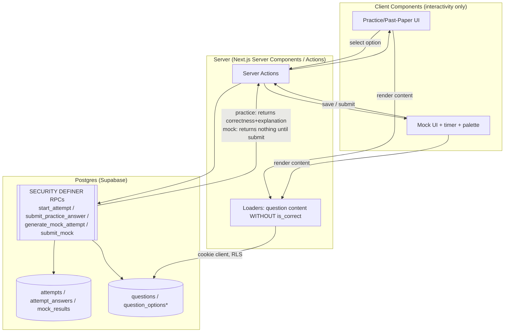

# Design Document: Practice / Past-Paper MCQs, Mock Tests & Analytics

## Overview

This feature delivers the three "attempt" experiences that sit on top of the
existing question bank, plus a results/analytics surface:

1. **Practice & Past-Paper MCQ screens** — a simple, single-question flow
   (Next / Previous, Save/Bookmark). The learner picks an option and gets
   **instant feedback**: the correct option turns green, a wrong pick turns red,
   and the explanation appears below. This is the gamified, Duolingo-style loop,
   rendered in our Soft Brutalism theme.
2. **Mock Test screen** — a timed, multi-section exam simulation (the NET
   Engineering paper: 200 MCQs = 100 Maths + 60 Physics + 40 English). It adds a
   countdown timer, Save, Mark-for-Review, Next/Prev Section, and a question
   grid/palette. **No feedback during the test.** The result is computed and
   shown only after final submission or when time expires.
3. **Analytics / Results** — after a mock submission, a result screen (and a
   history list) showing score, per-subject breakdown, and accuracy. Practice
   and past-paper are **resumable**: returning to a chapter resumes from the
   question the learner left off.

The central design tension is **trust**. Practice can reveal the answer
client-side because revealing it *is* the feature. A mock test must **not** let
the client see which option is correct — today `question_options.is_correct` is
readable by any authenticated user, which makes the score forgeable. The design
therefore introduces a **server-authoritative grading boundary**: a small set of
`SECURITY DEFINER` RPCs grade answers and persist outcomes, and direct read of
`question_options.is_correct` is **revoked** from the `anon`/`authenticated`
roles. Both practice and mock submit answers through this boundary; practice
simply asks for (and is allowed) the per-question correctness + explanation back,
while mock withholds correctness until submission.

Scope: this is one entry test (`net`). Mock generation, blueprint seeding,
attempt persistence, resume, and the result view are all in scope. Quick Notes
and Lectures remain out of scope (future `learning_resources`).

---

## Alignment with existing architecture

- **Schema is already in place** (migrations mcq_01–mcq_13). This feature adds
  **no new tables**; it seeds the NET mock blueprint, adds grading RPCs + a small
  number of read-side views/policies, and builds the UI + query/action layer.
  Confirmed table state: `attempts`, `attempt_answers`, `mock_results`,
  `bookmarks`, `mock_test_blueprints`, `mock_blueprint_slots` exist with
  owner-only RLS; `0` blueprint rows seeded.
- **Data reality** (verified): the `net` test has 1169 approved questions, **all
  tagged `past_paper`** (`question_tests.usage_type`), `0` `practice`. Difficulty
  spread per subject — Maths 85/158/83 (e/m/h), Physics 163/210/109, English
  123/140/47 — comfortably covers the mock's 200-question mix.
- **Business logic on the server** (steering: tech.md, design-system.md):
  attempt creation, answer grading, and scoring are Server Actions / RPCs.
  Client Components handle only interactivity (selection, timer tick, palette).
- **Data-fetching rules** (steering: data-fetching.md): question *content*
  (statement + options, **without** correctness) is catalog-like but
  test/chapter-scoped and only needs to be seen by signed-in learners, so it is
  read via the **authenticated cookie client under RLS**, not the anon cache.
  Per-user attempt state is always dynamic. We do **not** cache answers.
- **Soft Brutalism** (steering: design-system.md): 0px radius, 2px black borders,
  hard shadows, Space Grotesk headings, electric-blue accents. The
  `ui_design/quiz_screen` reference is a generic gray/rounded mock; we port its
  **mechanics** (sections, palette, save/review, timer) but **re-skin** to our
  system. Green = `#16a34a`-class correct, red = `danger #ba1a1a` wrong, used
  only for answer feedback.

---

## Key Design Decisions

### D1 — Server-authoritative grading; revoke client read of `is_correct`
**Problem.** `question_options.is_correct` is currently selectable by
`authenticated`. A learner could read the correct answer straight from the API
and forge a mock score. For a test-prep product, score integrity is core.

**Decision.** Move correctness behind a server boundary:
- **Revoke** `SELECT` on `question_options.is_correct` from `anon` +
  `authenticated` (column-level `GRANT`), keeping `id, question_id, option_label,
  content, content_format, display_order` readable for rendering. The RLS row
  policy stays; we additionally restrict the *column*.
- Add **`SECURITY DEFINER` RPCs** (owned by a privileged role, `search_path`
  pinned) that are the *only* way to learn correctness:
  - `submit_practice_answer(p_attempt_id, p_question_id, p_selected_option_id,
    p_time_taken_ms)` → grades one answer, upserts `attempt_answers`, and
    **returns** `{ is_correct, correct_option_id, explanation }`. Allowed because
    practice's whole purpose is instant feedback.
  - `submit_mock(p_attempt_id, p_answers jsonb)` → grades the whole paper in one
    transaction, writes all `attempt_answers`, computes + writes `mock_results`,
    flips the attempt to `submitted`, and returns the result summary. **Does not**
    reveal per-question correctness mid-test.
  - `start_attempt(...)` / `generate_mock_attempt(p_blueprint_id)` → see D3/D4.
- Every RPC **re-checks ownership** (`attempts.user_id = auth.uid()`) and test
  membership inside the function body (definer functions bypass RLS, so the body
  must enforce authorization explicitly — per the Supabase security checklist).
- `EXECUTE` on these RPCs is granted to `authenticated` only; `anon` is revoked.

**Why RPC over "just trust RLS".** RLS controls *row* visibility, not *column*
secrecy, and cannot compute a score atomically. A definer RPC gives us a single
audited choke point that both hides the answer key and performs the grade in one
round trip (also fewer requests → better perf, per react-best-practices
`async-*`).

### D2 — One attempt model, two modes (reuse existing tables)
`attempts.mode` is already `practice | mock`. We use it as-is:
- **Practice / past-paper** → `mode='practice'`, `blueprint_id NULL`,
  `topic_id` = the chapter node being practiced, `usage` distinguishes the two
  surfaces (see D6). One long-lived in-progress attempt per (user, topic, usage).
- **Mock** → `mode='mock'`, `blueprint_id` set, `expires_at` set from the
  blueprint duration. `mock_results` holds the 1:1 outcome.
`attempt_answers` is the shared analytics backbone for both. No schema change.

### D3 — Resume-where-you-left-off (practice/past-paper)
Practice attempts are **durable on the server**, not localStorage (the reference
app used localStorage; we upgrade to per-user server state so it follows the
learner across devices and powers analytics).
- On opening a chapter's practice/past-paper screen, `getOrCreatePracticeAttempt`
  finds the user's existing `in_progress` attempt for that (topic, usage) or
  creates one.
- Each answered question is persisted immediately via `submit_practice_answer`.
- "Where you left off" = first question in the ordered set with no
  `attempt_answers` row (else the last answered index). The screen opens there.
- An explicit "Finish / Reset" lets the learner end or restart the set.
- Question order is **stable per attempt** (deterministic ordering by
  `display_order, id`) so resume indices stay valid.

### D4 — Mock generation algorithm (server-side, blueprint-driven)
A **blueprint** defines the paper; a **generated attempt** freezes a concrete set
of questions for one sitting. Generation runs server-side in
`generate_mock_attempt` so the question selection (and the answer key) never
leaves the server.

**NET blueprint (seeded):**
- `duration_seconds` = 200 × 60 = `12000` (2 hrs; tunable — start at 120 min).
- `total_questions` = 200, three slots by `test_subject`:
  - Maths: 100, Physics: 60, English: 40.
- Per-slot `difficulty_mix` (jsonb) encodes the requested blend. The request was
  a loose "20–40 easy, 80 hard-ish, rest medium summing to 200" applied to the
  whole paper; we make it **deterministic and per-subject-proportional** so it is
  reproducible and testable:
  - Target whole-paper mix: **easy 30 / medium 90 / hard 80** (sums to 200; sits
    inside the requested 20–40 easy, 40–80 "hard band" interpreted as 80,
    80–100 medium band ~90). Encoded per slot proportional to its size:
    - Maths (100): easy 15, medium 45, hard 40
    - Physics (60): easy 9, medium 27, hard 24
    - English (40): easy 6, medium 18, hard 16
  - These live in `mock_blueprint_slots.difficulty_mix` as
    `{"easy":15,"medium":45,"hard":40}` etc., so tuning the mix is **data**, not
    code.

**Selection algorithm (per slot):**
1. Resolve the slot's subject's question pool for the test
   (`question_tests.entry_test_id = net` ∧ approved ∧ not deleted), partitioned
   by **effective difficulty** = `COALESCE(question_tests.difficulty,
   questions.difficulty)`.
2. For each difficulty band, randomly pick `mix[band]` questions
   (`ORDER BY random() LIMIT n`). Random selection is acceptable here because
   every question is explicitly curated into the test (no quality compromise,
   per the schema's D4).
3. **Shortfall handling**: if a band has fewer questions than requested, borrow
   the remainder from the nearest band (medium first), so a slot always reaches
   its `question_count`. (English hard=47 ≥ 16, so no shortfall today; the
   fallback keeps it robust if the pool shrinks.)
4. Concatenate slots in blueprint `display_order` (Maths → Physics → English) to
   form the **section** ordering; persist the frozen ordered question list for
   the attempt.

**Freezing the set.** The generated ordered question ids + their section index
are stored so the sitting is stable across reloads/resume. Options:
(a) a lightweight `attempt_questions` child table, or (b) seed one
`attempt_answers` row per selected question at generation time (with
`selected_option_id NULL`) to represent the frozen set + ordering. **Decision:**
use **(b)** — pre-insert `attempt_answers` rows (unanswered) at generation. It
needs **no new table**, the unique `(attempt_id, question_id)` already exists,
ordering is carried by a stable `ORDER BY` over a generation sequence we store in
`time_taken_ms`? No — that overloads a column. To avoid overloading semantics we
add **one nullable column** `attempt_answers.display_order int` (additive, safe)
to carry the frozen position. This keeps "no new table" while making ordering
explicit and queryable. (Revisit `attempt_questions` only if mock sittings ever
need per-question metadata beyond ordering.)

### D5 — Mock timer is server-anchored, client-displayed
The countdown is **display-only** on the client (a Client Component ticking each
second from `expires_at`). Authority is the server: `expires_at` is set at
generation; `submit_mock` **rejects/auto-finalizes** if `now() > expires_at`
(grace handled server-side). On time expiry the client calls `submit_mock`
automatically. This prevents clock-tampering from extending the test. The
reference app's `useQuizTimer` mechanics are reused but seeded from server
`expires_at`, not a client constant.

### D6 — Distinguish practice vs past-paper without a schema change
Both surfaces are `mode='practice'` over the same `topic`. They differ by which
**question pool** they draw and by a `usage` discriminator. Since today all
questions are `past_paper`, both surfaces currently show the same pool; the
distinction is forward-looking (when `practice`-tagged questions are added).
- The screen passes `usage ∈ {past_paper, practice}`; the loader filters
  `question_tests.usage_type = usage` when a `practice` pool exists, else falls
  back to the full chapter pool so the practice screen is never empty pre-tagging.
- To keep resume attempts separate per surface, the attempt is keyed by
  `(user, topic, mode='practice', usage)`. `usage` is carried on the attempt via
  the existing `test_subject_id`? No — that's the subject link. **Decision:** add
  one nullable column `attempts.usage question_usage` (additive) to tag which
  surface a practice attempt belongs to. Mock attempts leave it null.

### D7 — Reads stay RLS-scoped & uncached; question content excludes answers
- Question content for a screen is fetched server-side via the **cookie client**
  (authenticated, RLS) — never the anon cache, because attempts are per-user and
  we must not cache the (now answer-stripped) option set in a shared store keyed
  only by chapter (it's fine to render, but mixing it into the catalog cache adds
  no value and risks future answer leakage). A future optimization could cache
  the answer-free option payload, but we keep it simple and correct now.
- After D1, the option payload the client receives **cannot** include
  `is_correct`. Practice feedback comes *only* from the grading RPC's return.

### D8 — Result & analytics: read from `mock_results` + `attempt_answers`
- The mock result screen reads the 1:1 `mock_results` row (`score_percent`,
  correct/incorrect/skipped, `per_subject` jsonb) — all computed server-side at
  submit. No client scoring (the reference app's client `calculateResults` is
  dropped in favor of server truth).
- The analytics/history page lists the user's submitted mock attempts with score
  + date, and links to each result. Practice analytics (accuracy by chapter) is a
  thin read over `attempt_answers`; for this iteration we surface **mock results**
  primarily (per the request) and a lightweight practice "resume" entry point.
- `per_subject` is written as
  `{"maths":{"correct":63,"total":100}, ...}` for fast render without re-joining.

### D9 — Pure, testable core extracted to helpers (tests-first culture)
All non-trivial logic that can be pure **is** pure and unit-tested (workflow.md
requires tests):
- `lib/quiz/mock-plan.ts` — given blueprint slots + available pool counts,
  compute the exact per-(subject,difficulty) pick counts incl. shortfall
  borrowing. Deterministic → fully unit-testable without a DB.
- `lib/quiz/scoring.ts` — given answers + key, compute totals + `per_subject`.
  (Mirrors what the SQL does, used for client-side *display math* like progress
  and as the reference oracle in tests.)
- `lib/quiz/session.ts` — resume index, section boundaries, palette state
  (answered/saved/review/current) derivation. Pure.
- `lib/quiz/time.ts` — `formatTime`, remaining-time from `expires_at`. Pure.
SQL grading is verified separately with an integration check (seed a tiny
attempt, submit, assert counts).

---

## Architecture

### Request / trust boundary


`question_options*` = `is_correct` column readable **only** inside the definer
RPCs after the column grant is revoked from client roles.

### Routes (App Router, under the authed `(dashboard)` group)

```
app/(dashboard)/subjects/[slug]/[chapter]/
  practice/page.tsx        ← practice MCQ screen (usage=practice)
  past-paper/page.tsx      ← past-paper MCQ screen (usage=past_paper)
app/(dashboard)/mock/
  page.tsx                 ← mock landing (start NET mock, list past results)
  [attemptId]/page.tsx     ← active timed mock sitting
  [attemptId]/result/page.tsx ← mock result (post-submit)
app/(dashboard)/performance/
  page.tsx                 ← analytics: mock history + accuracy summary
```
The chapter buttons in `components/dashboard/chapter-list.tsx` already link to
`…/past-paper` and `…/practice`; this wires those targets.

### Components (ported from `ui_design/quiz_screen`, re-skinned to Soft Brutalism)

```
components/quiz/
  question-card.tsx        ← statement + option list (radio); feedback colors
  option-button.tsx        ← single option; states: idle/selected/correct/wrong
  explanation-panel.tsx    ← shown after answer (practice/past-paper)
  practice-runner.tsx      ← client orchestrator: practice/past-paper loop
  mock-runner.tsx          ← client orchestrator: timed mock
  quiz-timer.tsx           ← countdown from expires_at (mock only)
  quiz-navigation.tsx      ← Save / Next / Prev / (Mark Review, Next/Prev Section)
  question-palette.tsx     ← grid of question states (mock)
  section-progress.tsx     ← per-subject answered counts (mock)
  bookmark-button.tsx      ← toggle bookmark (both)
  mock-result.tsx          ← score + per-subject breakdown (server data)
```
Server Components fetch and pass plain data down; the `*-runner` Client
Components own state + call Server Actions.

### Data / action layer

```
lib/queries/
  practice.ts   ← getOrCreatePracticeAttempt, getPracticeScreen (content, resume idx)
  mock.ts       ← getMockLanding, getMockAttempt (frozen set + content), getMockResult
  performance.ts← listMockResults, practiceAccuracySummary
lib/quiz/       ← pure helpers (mock-plan, scoring, session, time) + *.test.ts
app/(dashboard)/quiz-actions.ts  ← Server Actions wrapping the RPCs:
  startPractice, answerPractice, finishPractice,
  startMock, saveMockAnswer, toggleReview, submitMock, toggleBookmark
```

---

## Database changes (migration `mcq_14_attempt_grading`)

All DDL via a new migration (workflow.md: never edit applied migrations). After
applying: run `get_advisors` (security + performance), then regenerate
`lib/database.types.ts`.

### 1. Additive columns (safe, nullable)
```sql
alter table attempts        add column usage question_usage;      -- practice surface tag (D6)
alter table attempt_answers add column display_order int;         -- frozen mock ordering (D4)
```

### 2. Hide the answer key from clients (D1)
```sql
-- Strip is_correct from the columns the API roles may read.
revoke select on public.question_options from anon, authenticated;
grant  select (id, question_id, option_label, content, content_format, display_order)
  on public.question_options to anon, authenticated;
-- RLS row policies remain; definer RPCs (owner: postgres) still read is_correct.
```

### 3. Grading RPCs (SECURITY DEFINER, search_path pinned, ownership-checked)
Signatures (full bodies in tasks):
```sql
create function start_attempt(p_entry_test text, p_topic uuid, p_usage question_usage)
  returns uuid ...                       -- get-or-create practice attempt; returns attempt id
create function submit_practice_answer(p_attempt uuid, p_question uuid,
  p_option uuid, p_time_ms int)
  returns table(is_correct boolean, correct_option_id uuid, explanation text) ...
create function generate_mock_attempt(p_blueprint uuid)
  returns uuid ...                       -- selects+freezes 200 Qs, sets expires_at
create function submit_mock(p_attempt uuid, p_answers jsonb)
  returns uuid ...                       -- grades all, writes mock_results, returns attempt id
```
Each body: `if not exists (select 1 from attempts a where a.id=p_attempt and
a.user_id = (select auth.uid())) then raise exception 'forbidden'; end if;` and
validates the question/option belong to the test. `revoke execute ... from anon;`
`grant execute ... to authenticated;`.

### 4. (Optional) read view for mock content without answers
A `mock_attempt_questions` view (security_invoker) joining the frozen
`attempt_answers` order → questions + options (answer-free) for clean rendering.
Owner-only via the underlying `attempts` RLS.

### 5. Seed the NET mock blueprint + slots (data migration)
Insert one `mock_test_blueprints` row (`external_id='net-full-mock'`, 200 Qs,
120 min) + three `mock_blueprint_slots` referencing the NET `test_subjects`, with
`question_count` 100/60/40 and the `difficulty_mix` from D4. Idempotent on
`external_id` / `(blueprint_id, test_subject_id)`.

---

## Error handling

- **Not authenticated** → loaders redirect to `/auth/login` (consistent with
  existing pages); RPCs raise `forbidden` if `auth.uid()` is null.
- **Empty pool / shortfall** → `generate_mock_attempt` borrows across bands; if
  the total still can't be met (not possible with current data), it raises a
  clear error surfaced as a Soft-Brutalism error card, not a crash.
- **Expired mock** → `submit_mock` finalizes with whatever was saved; the client
  auto-submits on timer zero. Late submit returns the already-final result.
- **Double submit / re-grade** → `submit_mock` is idempotent: if the attempt is
  already `submitted`, return the existing `mock_results` id (no re-grade).
- **Invalid option/question** (not in attempt) → RPC raises; action returns a
  typed error the runner shows inline.
- **Resume safety** → practice answers upsert on `(attempt_id, question_id)`, so
  re-answering overwrites cleanly.

## Security checklist (applied)

- ✅ `is_correct` column read **revoked** from client roles; correctness only via
  definer RPCs.
- ✅ Definer RPCs pin `search_path=public`, re-check `auth.uid()` ownership in the
  body, and are `revoke execute from anon`.
- ✅ No `user_metadata` used in any authz decision.
- ✅ Attempt/answer/result tables keep owner-only RLS (`auth.uid()` predicates
  with both `using` and `with check` on writes).
- ✅ Mock score computed server-side; client never trusted for grading.
- ✅ Timer authority on the server via `expires_at`.
- ✅ Run `get_advisors` after the migration; fix any new findings.

## Testing strategy

- **Pure helpers** (`lib/quiz/*.test.ts`, Vitest): mock-plan pick counts +
  shortfall borrowing; scoring totals + `per_subject`; resume-index + section
  boundaries; `formatTime` / remaining-time. Target the tricky math, edge counts
  (band shortfalls, all-skipped, all-correct, time-zero).
- **SQL grading** integration check: seed a 3-question attempt, call
  `submit_mock`, assert `mock_results` matches the oracle from `scoring.ts`.
- **Build/lint** gates per workflow.md (`npm run build`, `npm run lint`,
  `npm run test`).
- **Runtime** verified later via the `next-dev-loop` skill against the running
  dev server (user runs `npm run dev`).

## Out of scope (this spec)

- Quick Notes / Lectures (`learning_resources`).
- Multiple entry tests / additional blueprints (data-extensible later).
- LaTeX/math rendering (content is `plain` today).
- Deep practice analytics dashboards (charts) beyond the mock history + a basic
  accuracy summary.
